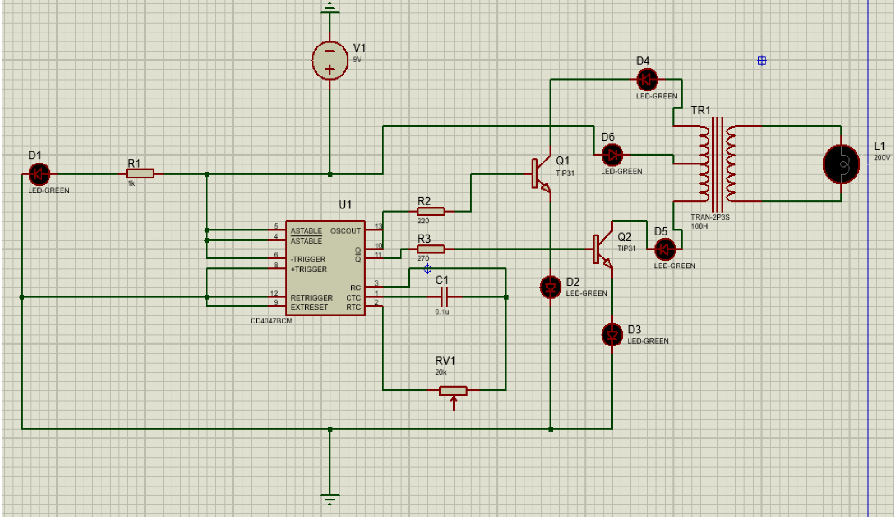

# ⚡ Power Efficient Mini Inverter

**A hardware-based project to convert 12V DC into 220V AC using CD4047 IC, TIP31C transistors, and a step-up transformer.**  
Designed as part of the **Network Theory Project** at **NIT Agartala (Session 2024–25).**

---

## 🎯 Objective
To design and implement a **mini inverter** that efficiently converts a low DC input (12V) into a standard AC output (220V), suitable for small-scale backup power applications.

---

## 🔎 Overview
An inverter is an essential electronic device that converts **Direct Current (DC)** into **Alternating Current (AC)**.  
This project demonstrates a **low-cost, power-efficient mini inverter** built using:

- **IC CD4047**: CMOS low-power multivibrator, configured as an astable multivibrator to generate square wave pulses.  
- **TIP31C NPN Power Transistors**: Used as switches to drive the transformer.  
- **Step-up Transformer**: Converts 12V DC pulses into 220V AC via electromagnetic induction.  

The resulting system is compact, cost-effective, and can serve as a **backup power supply** or be integrated into **solar-based systems**.

---

## 🛠 Components Required
- IC **CD4047** × 1  
- Step-down/Step-up Transformer (12-0-12V, 1A) × 1  
- Power Transistor **TIP31C (NPN)** × 2  
- Resistor **220Ω** × 2  
- Variable Resistor **20kΩ** × 1  
- Resistor **1kΩ** × 1  
- Capacitor **0.1 μF** × 1  
- LED (Green, 5mm) × 1  
- Breadboard & jumper wires  
- Power supply (12V DC source)  

💰 **Estimated Cost**: ₹1663  

---

## ⚡ Working Principle
1. **Pulse Generation**  
   - The CD4047 IC is configured in astable mode to generate continuous square wave pulses.  

2. **Switching Operation**  
   - These pulses drive TIP31C transistors, which act as switches, alternating the current flow through the primary coil of the transformer.  

3. **AC Conversion**  
   - The alternating current in the transformer primary induces a high-voltage AC signal (220V) in the secondary coil through **electromagnetic induction**.  

4. **Output**  
   - The result is a **220V AC output** derived from a 12V DC source.  

---

## 📐 Circuit Diagram

  

---

## 🚀 Applications
- Emergency backup power systems  
- Solar-based inverter systems  
- Portable power solutions  
- Educational demonstration of inverter design  

---

## 🎓 Learning Outcomes
- Hands-on understanding of **multivibrator circuits** using CD4047  
- Application of **transistors as power switches**  
- Practical knowledge of **transformers in DC–AC conversion**  
- Skills in **circuit prototyping and testing**  

---

## 👥 Contributors
- Nishant Kr. Karn (23UEI133)  
- Keshav Yadav (23UEI174)  
- Rakesh Kumar (23UEI185)  
- Manjesh Kumar (23UEI144)  
- Shankar Kumar (23UEI129)  
- Aryan Giri (23UEI131)  
- Prasun Kumar (23UEI105)  

**Affiliation:** National Institute of Technology, Agartala – Department of Electronics & Instrumentation Engineering  

---

## 📚 References
- [Square Wave Pulse Generator using IC CD4047](https://theorycircuit.com/digital-electronics/square-wave-pulse-generator-circuit-using-ic-cd4047/)  
- [Arduino Inverter Circuit](https://theorycircuit.com/arduino-projects/arduino-inverter-circuit/)  
- [Solar Powered Arduino Systems](https://theorycircuit.com/solar-circuits/solar-powered-arduino/)  

---
